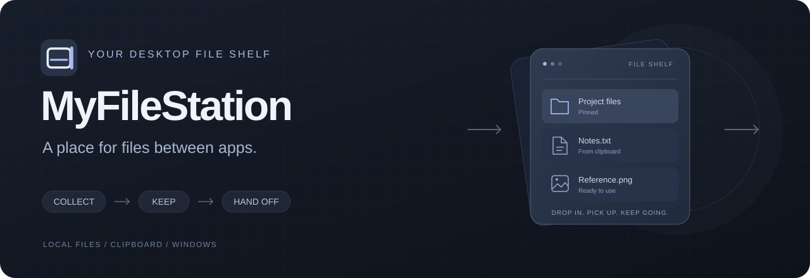

<p align="center">
  
</p>

<p align="center">
  <a href="https://github.com/JeremyL691/MyFileStation/actions/workflows/windows.yml"></a>
  <a href="https://github.com/JeremyL691/MyFileStation/releases"></a>
  
  <a href="LICENSE"></a>
</p>

<p align="center">
  <strong>把文件先放一下，再送到需要的应用。</strong><br />
  为 Windows 准备的侧边文件暂存架，支持文件、文件夹和剪贴板内容。
</p>

<p align="center">
  简体中文 · <a href="README.en.md">English</a><br />
  <a href="https://github.com/JeremyL691/MyFileStation/releases">下载已发布版本</a> ·
  <a href="#三步上手">快速上手</a> ·
  <a href="https://github.com/JeremyL691/MyFileStation/issues/new/choose">反馈问题</a> ·
  <a href="CONTRIBUTING.md">参与开发</a>
</p>

## 文件的临时落脚点

在资源管理器里找到文件，却还没打开接收它的应用？先拖到屏幕边缘，放进 MyFileStation；准备好后再拖出去。也可以直接粘贴剪贴板里的文件、文字或图片，把零散内容集中到一处。

| 能做什么 | 使用方式 |
| --- | --- |
| 侧边唤出 | 从资源管理器或桌面拖文件到左侧或右侧屏幕边缘 |
| 暂存多种内容 | 引用文件和文件夹；将粘贴的文字、图片保存为本地文件 |
| 找到需要的条目 | 按名称或路径搜索，按类型筛选，支持多选 |
| 保留常用内容 | 固定条目，重启后从 SQLite 恢复暂存记录与设置 |
| 交给其他应用 | 以复制方式拖出，或复制文件、复制路径 |
| 按习惯使用 | 系统托盘、可配置快捷键、中英文、浅色 / 深色 / 跟随系统 |

**外部文件只保存引用。** 从暂存架移除条目不会删除原文件或文件夹；粘贴生成的内容则由应用管理，并按设置延迟回收。

## 下载与版本状态

| 你想做什么 | 入口 |
| --- | --- |
| 使用已发布版本 | [GitHub Releases](https://github.com/JeremyL691/MyFileStation/releases)，按对应版本说明下载 |
| 试用当前开发版本 | [Windows Actions](https://github.com/JeremyL691/MyFileStation/actions/workflows/windows.yml) 成功运行后的 `MyFileStation-windows-x64` 构建产物，或[自行构建](#本地开发) |
| 查看本轮验收结果 | [验收报告](QA_REPORT.md) · [测试矩阵](TESTING.md) · [更新记录](CHANGELOG.md) |

当前源码为 **0.3.0 发布候选阶段**，采用 Rust + Tauri 2 + React。已发布的 **v0.2.0** 使用上一代 Python / PySide6 实现，界面与操作可能不同。完整跨应用拖放、安装升级及长期稳定性验证仍待完成，详见验收报告。

Windows 10 / 11 x64，需要 Microsoft WebView2 Runtime。0.3.0 安装包按当前用户安装，并使用 WebView2 引导安装方式；便携 ZIP 解压后运行 `Start-MyFileStation.cmd`，启动器会检查运行时。便携版的数据仍保存在当前用户目录。

## 三步上手

1. **唤出面板**：从托盘显示，或使用默认快捷键 `Ctrl+Alt+Space`；也可从资源管理器 / 桌面拖文件到屏幕边缘。
2. **放入内容**：拖入文件或文件夹，使用“添加文件 / 添加文件夹”，或在面板中按 `Ctrl+V` 粘贴。
3. **继续使用**：选中条目后拖到目标应用支持的文件接收区域，或按 `Ctrl+C` 复制文件。常用条目可以固定。

默认在成功拖出后移除未固定条目，可在设置中关闭。拖出始终使用复制方式，外部源文件保持原位。

| 操作 | 快捷键 / 手势 |
| --- | --- |
| 显示 / 隐藏面板 | `Ctrl+Alt+Space`，可在设置中修改 |
| 从剪贴板添加 | `Ctrl+V` |
| 复制所选文件 | `Ctrl+C` |
| 全选当前筛选结果 | `Ctrl+A` |
| 连续 / 分散选择 | `Shift` / `Ctrl` + 单击 |
| 打开条目 | 双击，或条目获得焦点时按 `Enter` |
| 切换条目选择 | 条目获得焦点时按 `Space` |
| 移除所选条目 | `Delete`；固定内容需要确认 |
| 隐藏面板 | `Esc` |

## 使用范围

- 屏幕边缘自动唤出针对资源管理器与桌面的本地文件拖动。浏览器网页图片、虚拟附件等拖入来源不在当前支持范围内。
- 拖出是否被接收取决于目标应用的文件导入能力；完整目标应用验证记录见 [TESTING.md](TESTING.md)。
- 建议以普通用户权限运行，与资源管理器保持一致，避免 Windows 权限隔离阻止拖放。
- 当前提供 Windows x64 构建。

## 数据与隐私

应用在 `%LOCALAPPDATA%\MyFileStation\v2` 保存 SQLite 数据库、剪贴板生成文件、缩略图与日志。外部文件保留在原位置；移动或删除原文件后，条目会显示为暂不可用。

应用不使用遥测，也不会把剪贴板文字写入日志。首次运行新版时会读取 `%APPDATA%\MyFileStation\settings.json` 中可识别的旧版设置，并保留原文件；旧版暂存条目不会自动迁移。

## 本地开发

需要 Windows 10 / 11 x64、Rust stable（MSVC）、Visual Studio 2022 C++ Build Tools 与 Windows SDK、Node.js 22+、pnpm 11，以及 WebView2 Runtime。

```powershell
git clone https://github.com/JeremyL691/MyFileStation.git
cd MyFileStation
pnpm install --frozen-lockfile
pnpm dev
```

`pnpm dev` 同时启动 Vite 和 Tauri 桌面应用。纯前端服务使用 `pnpm --filter @myfilestation/frontend dev:web`，但原生文件与窗口功能需要 Tauri 环境。

```powershell
# 自动化验收，包含独立存储压力测试
./scripts/test-windows.ps1 -IncludeStress

# 构建当前用户安装包，再生成便携 ZIP 与 SHA-256 校验文件
./scripts/build-windows.ps1
./scripts/package-portable.ps1
```

构建产物写入 `release/`。只需要便携版时，第一条构建命令加 `-SkipInstaller`。更多说明见 [参与开发](CONTRIBUTING.md) 和 [架构说明](docs/ARCHITECTURE.md)。

旧版 Python 源码保留在 `src/myfilestation/`，可用 `python -m pip install -r requirements.txt` 后运行 `python run_myfilestation.py`；回退测试为 `python -m pytest -q`。

## 反馈与贡献

欢迎提交 [问题反馈或功能建议](https://github.com/JeremyL691/MyFileStation/issues/new/choose)。报告拖放问题时，请附 Windows、显示缩放、目标应用版本和复现步骤，避免上传私人文件或未经处理的日志。

[MIT License](LICENSE) · Copyright © 2026 JeremyL691
